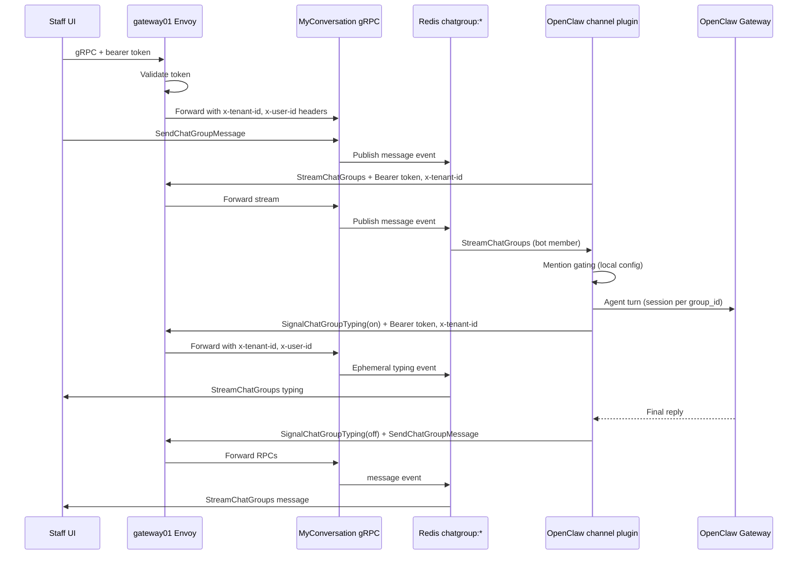
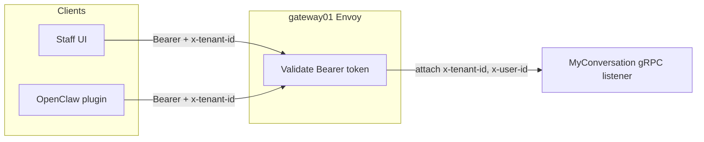

# OpenClaw × myconversation Staff Group Chat — Design Spec

**Date:** 2026-06-08  
**Status:** Approved (brainstorming)  
**Scope:** Staff Group Chat (`ChatGroup`) only — not customer inbox (`Conversation`).

---

## 1. Summary

Integrate **OpenClaw** (tenant self-hosted Gateway) with **myconversation Staff Group Chat** so OpenClaw participates as a normal group member — UX comparable to chatting with OpenClaw via Telegram (typing indicator + single complete reply in v1).

**Key simplification:** myconversation does **not** own OpenClaw configuration. The OpenClaw channel plugin holds `tenant_id`, **service-user bearer `token`**, `endpoint`, optional **`userId`** (plugin-local only), and mention/always-on rules (same pattern as the Telegram channel). Bot is added to groups via existing `AddChatGroupMember`. No mysetting keys, no OpenClaw-specific RPCs, no dedicated DB tables.

---

## 2. Decisions (locked)

| Topic | Decision |
|-------|----------|
| Chat surface | Staff Group Chat (`ChatGroup`) only |
| OpenClaw deployment | Per-tenant self-hosted Gateway |
| Integration style | OpenClaw channel plugin (recommended approach) |
| Bot identity | Service user — normal `user_id` from myid |
| Add bot to group | Existing `AddChatGroupMember` (no dedicated RPC) |
| Activation mode | OpenClaw plugin config (`requireMention` per group), like Telegram |
| Auth (staff UI) | **gateway01 (Envoy)** validates token → attaches `x-tenant-id`, `x-user-id`, … → forwards to myconversation |
| Auth (OpenClaw) | Plugin calls **gateway01** (or equivalent) with `Authorization: Bearer <token>` + `x-tenant-id`; gateway validates token and attaches `x-user-id` downstream — **same trust path as staff UI** |
| myconversation auth | **None** — service reads identity from metadata headers injected by gateway |
| Plugin config | `endpoint`, `tenant_id`, `token`; optional `userId` for plugin-side filters only (+ group policies in OpenClaw) |
| Reply UX v1 | Typing indicator + one complete message (no streaming) |
| myconversation code changes | **Typing indicator only** — no new listener, no auth interceptor changes |

---

## 3. Architecture





**Auth boundary:** myconversation does not validate tokens. Both staff UI and OpenClaw plugin present a **myid access token** to gateway01; Envoy validates it and injects `x-tenant-id` / `x-user-id` before forwarding to myconversation.

---

## 4. myconversation changes

### 4.1 Existing gRPC listener — no auth changes

**Current model (unchanged):**

- myconversation exposes a **single existing gRPC listener** (not public on the internet).
- The service **does not perform token auth** — it reads identity from gRPC metadata headers (`x-tenant-id`, `x-user-id`, …) via `internal/server/extractor`.
- **Staff UI path:** client → **gateway01 (Envoy)** → Envoy validates bearer token → Envoy attaches headers → forwards to myconversation.
- **OpenClaw path:** plugin → **gateway01 (Envoy)** → same validation → forwards to myconversation. Plugin sends `authorization: Bearer <token>` and `x-tenant-id` on every RPC; it does **not** send `x-user-id` itself.

**No new listener. No auth interceptor changes in myconversation for this feature.**

**Security model:** Bot identity on the wire is the **service user's access token** (minted via myid, stored in OpenClaw config). Compromise of the token grants the same API access as that user — same as any staff bearer token. Plugin `endpoint` should point at gateway01 (or an internal equivalent that performs the same validation), not at the raw myconversation listener unless a future internal auth layer is added.

**RPCs used by plugin (unchanged signatures except new typing RPC):**

| RPC | Purpose |
|-----|---------|
| `StreamChatGroups` | Receive messages + typing for groups where bot is member |
| `SendChatGroupMessage` | Post bot replies |
| `SignalChatGroupTyping` | **New** — ephemeral typing on/off |

### 4.2 Typing indicator

**Proto additions** (`api/myconversation.proto`):

```protobuf
message SignalChatGroupTypingRequest {
  int64 group_id = 1 [(validate.rules).int64 = { gt: 0 }];
  bool typing    = 2;  // true = on, false = off
}

message SignalChatGroupTypingReply {}

message ChatGroupTypingIndicator {
  int64 group_id  = 1;
  int64 user_id   = 2;
  string username = 3;
  bool typing     = 4;
}

// Add to ChatGroupStreamEvent oneof:
//   ChatGroupTypingIndicator typing = 5;
```

**Behavior:**

- Caller must be an **active member** of `group_id` (same check as `SendChatGroupMessage`).
- **No DB persistence** — publish only via `chatgroupstream.Hub`.
- **Not replayed** on `StreamChatGroups` reconnect (ephemeral; clients clear stale typing on disconnect).
- Resolve `username` via existing `myidResolver.DisplayNameByUserID` when publishing (best-effort).

**Service RPC:**

```protobuf
rpc SignalChatGroupTyping(SignalChatGroupTypingRequest) returns (SignalChatGroupTypingReply);
```

### 4.3 Explicitly out of scope (myconversation)

- New gRPC listener or auth interceptor changes
- mysetting `openclaw` key
- Ent schema / table for OpenClaw per-group config
- `AddOpenClawToGroup` / `UpdateOpenClawGroup` / `RemoveOpenClawFromGroup` RPCs
- `is_openclaw_bot` flags on member proto
- Streaming partial message updates (phase 2)
- Customer inbox (`Conversation`) integration
- Centralized multi-tenant OpenClaw Gateway

---

## 5. OpenClaw channel plugin

**Deliverable:** [marketplace/openclaw/myconversation](https://gitlab.genjutsu.ai/marketplace/openclaw/myconversation) — installable via `openclaw plugins install . --link` from that repo root.

### 5.1 Plugin config (example)

```json5
{
  channels: {
    myconversation: {
      endpoint: "gw01-sales01.genjutsu.ai:443",
      tenantId: "tenant-abc",
      token: "eyJ...",
      userId: 123456789,
      username: "OpenClaw",
      activeGroupsPolicy: "allowlist",
      groups: {
        "42": { requireMention: true },
        "99": { requireMention: false },
      },
    },
  },
}
```

| Field | Role |
|-------|------|
| `endpoint` | gRPC host:port for **gateway01** (same entry staff UI uses) |
| `tenantId` | gRPC metadata `x-tenant-id` on every call |
| `token` | Service user's myid access token; sent as `authorization: Bearer <token>` on every call |
| `userId` | **Optional, plugin-local only** — see §5.1.1 |
| `username` | **Optional** — username for `@mention` text matching when `requireMention: true` |
| `activeGroupsPolicy` / `groups` | Which groups are active and mention gating |

Global defaults can mirror OpenClaw Telegram: default `requireMention: true` for groups not listed.

#### 5.1.1 Why optional `userId` still exists

`userId` is **not** sent on the wire after the bearer-token change. Gateway derives the authenticated user from `token`. The plugin keeps an optional numeric `userId` because **inbound stream events do not include the token** — they only carry numeric ids:

| Plugin need | Without `userId` | With `userId` |
|-------------|------------------|---------------|
| **Self-message drop** — skip bot's own messages echoed on `StreamChatGroups` | Bot may re-dispatch its own replies → wasted agent turns / risk of loops | Compare `sender_user_id === userId` and skip |
| **Mention-by-id** — UI sends `mentioned_user_ids[]` | Only `@username` text matching works (needs `username` config) | Also accept when `mentioned_user_ids` contains `userId` |

`userId` should match the myid user that owns `token` (the service account added via `AddChatGroupMember`). If omitted: mention-only groups can still work via `@username`; self-message filtering and mention-by-id are degraded.

**Not used for auth** — compromising `userId` alone does nothing; only `token` grants API access.

### 5.2 Plugin runtime

1. **Connect:** gRPC client to `endpoint` with metadata `x-tenant-id` + `authorization: Bearer <token>`; open server stream `StreamChatGroups`. Exponential backoff on stream errors.
2. **Membership:** Only receives events for groups where bot was added via `AddChatGroupMember` (server filters by membership).
3. **Inbound filter:**
   - Drop messages where `userId` is set and `sender_user_id == userId`.
   - Apply `requireMention` using `mentioned_user_ids` (when `userId` set) and/or `@username` in content.
   - Respect `activeGroupsPolicy` / `groups` allowlist.
4. **Session routing:** Map `group_id` → OpenClaw agent session (memory, tools, skills per group — native OpenClaw behavior).
5. **Outbound:**
   - `SignalChatGroupTyping(typing=true)` before agent turn.
   - Run agent via Gateway.
   - `SignalChatGroupTyping(typing=false)` on completion or error.
   - `SendChatGroupMessage` with final text (and media URLs if agent returns them).
   - Use `client_message_id` for idempotency on retries.
6. **Reconnect:** Resume with `resume_after_message_id`; handle stream ping keepalives (existing `ChatGroupStreamPing`).

### 5.3 Bot loop protection

Enable OpenClaw shared bot loop protection so bot-to-bot reply chains cannot run indefinitely if multiple bots are in the same group.

### 5.4 Operator setup (tenant)

1. Create myid service user (e.g. display name "OpenClaw").
2. Mint long-lived access token for service user; configure plugin with `tenantId` + `token` + gateway `endpoint` (+ optional `userId` for mention/self filters).
3. Install plugin on tenant OpenClaw Gateway; restart Gateway.
4. In myconversation UI/API: `AddChatGroupMember(group_id, user_id=<service user>)` like any staff member.
5. Adjust mention/always-on per group in OpenClaw config (or future `/activation` command in plugin).

---

## 6. Data flow — mention detection

Plugin-side only (no server changes):

| Mode | Trigger |
|------|---------|
| `requireMention: true` | `mentioned_user_ids` contains `userId` (when configured), OR content matches `@<bot display name>` |
| `requireMention: false` | Every non-bot message in allowlisted group |

Unmentioned messages in mention-only groups may still be stored as OpenClaw context (ambient) if plugin opts into OpenClaw `unmentionedInbound: "room_event"` — optional, not required v1.

---

## 7. Error handling

| Failure | Behavior |
|---------|----------|
| Plugin disconnected from stream | Auto-reconnect with resume cursor; staff see delay, not data loss for persisted messages |
| Agent turn fails | `typing(false)`; optional short error message via `SendChatGroupMessage` (plugin decision) |
| Bot not group member | Stream silently excludes group events; plugin logs warning if config references unknown group |
| myconversation unreachable from plugin pod | Plugin logs + OpenClaw doctor diagnostics; no impact on staff UI |
| Duplicate send retry | `client_message_id` idempotency on `SendChatGroupMessage` |

---

## 8. Testing

**myconversation:**

- Unit: `SignalChatGroupTyping` membership check, hub publish shape, stream skip/replay rules for typing events.
- Integration: gRPC via gateway with `x-tenant-id` + bearer token; myconversation still sees `x-tenant-id` + `x-user-id` after Envoy injection.
- Regression: staff path via gateway01 unchanged; extractor still rejects missing headers.

**Plugin (separate repo):**

- Mention gating matrix (mention / no mention / always-on group).
- Self-message skip.
- Typing on → message → typing off ordering.
- Stream reconnect + resume.

**Manual E2E:**

1. Add bot user to test group.
2. Staff sends message with @mention → bot replies with typing visible in UI.
3. Configure always-on group → bot replies without mention.

---

## 9. Rollout

1. Ship myconversation: `SignalChatGroupTyping`.
2. Ship dev test UI: `web/chatgroup-test/` (typing indicator + stream + send).
3. Publish OpenClaw plugin with setup README.
4. Pilot E2E using dev UI + plugin on one tenant.

---

## 11. Dev test Web UI (Telegram-style)

**Goal:** Minimal browser UI to manually test Staff Group Chat + OpenClaw E2E before production FE exists.

**Location:** `web/chatgroup-test/` in myconversation repo — **dev tool only**, not shipped in production Docker image.

### 11.1 Layout (Telegram Desktop–inspired)

```
┌─────────────────┬──────────────────────────────────────┐
│  Groups         │  Group name                    ⋮     │
│  ─────────────  │  ─────────────────────────────────── │
│  ● Support      │                                      │
│    last msg…    │     Alice: hello                     │
│  ○ OpenClaw lab │              ┌──────────────┐      │
│                 │              │ hi @OpenClaw │  You │
│  [+ New group]  │              └──────────────┘      │
│                 │  OpenClaw is typing…                 │
│                 │  ┌──────────────┐                  │
│                 │  │ Sure, …      │ OpenClaw         │
│                 │  └──────────────┘                  │
│                 │  ─────────────────────────────────── │
│                 │  [@] [ message…          ] [Send]    │
└─────────────────┴──────────────────────────────────────┘
```

- **Dark theme**, system font stack (no custom assets).
- **Own messages** — bubble right, accent blue (`#2AABEE` Telegram-like).
- **Others / bot** — bubble left, dark gray.
- **Typing line** — italic, below messages (from `ChatGroupTypingIndicator` stream event).

### 11.2 Features (v1 minimum)

| Feature | RPC |
|---------|-----|
| Login (gateway URL + username + password) | myid `SignIn` + `CreateAccessToken` via grpc-web |
| List & select groups | `ListMyChatGroups` |
| Load message history | `ListChatGroupMessages` (newest page; render chronological) |
| Live updates | `StreamChatGroups` (filter to active group + update sidebar preview) |
| Send text | `SendChatGroupMessage` |
| @mention members | `ListChatGroupMembers` → pick user → set `mentioned_user_ids` |
| Typing indicator | Handle `ChatGroupTypingIndicator` on stream |
| Create group | `CreateChatGroup` (name + visibility PUBLIC) |
| Add member by user_id | `AddChatGroupMember` (for adding OpenClaw bot user) |
| Settings panel | Persist gateway URL, optional default `bot_user_id` hint for @mention label |

**Out of scope v1:** images/video/files, edit/delete, search, roles, private notes, production auth hardening, mobile layout.

### 11.3 Transport

- Browser → **gateway01** (grpc-web), same as staff scripts in `scripts/_gateway_common.py`.
- Headers on every MyConversation call: `Authorization: Bearer <access_token>`, `x-tenant-id`, `x-user-id` (from token cache after login).
- CORS: must work on target gateway env (stg); document if `--cluster`/port-forward needed locally.

### 11.4 Tech stack

- **Vite** + **TypeScript**, vanilla DOM (no React).
- **grpc-web** client + generated JS stubs from `api/*.proto` (via genkit JS codegen or `@genjutsu/myconversation` npm package).
- **CSS** single file, Telegram-like tokens (CSS variables).
- `README.md` with `npm install && npm run dev` and E2E test steps with OpenClaw.

### 11.5 Manual E2E checklist (UI + OpenClaw)

1. Login → see groups.
2. Create group → add OpenClaw `bot_user_id` via Add member.
3. Send `@OpenClaw hello` → see typing → bot reply appears.
4. Open second browser session (another staff user) → both see live messages.

---

## 10. Open questions (deferred)

- Plugin repo location (Genjutsu GitLab org name).
- Exact myconversation gRPC port / K8s Service name for plugin `endpoint` config (ops doc only — no code change).
- Whether stg gateway01 CORS allows `localhost` for dev UI (may need port-forward or env flag).
