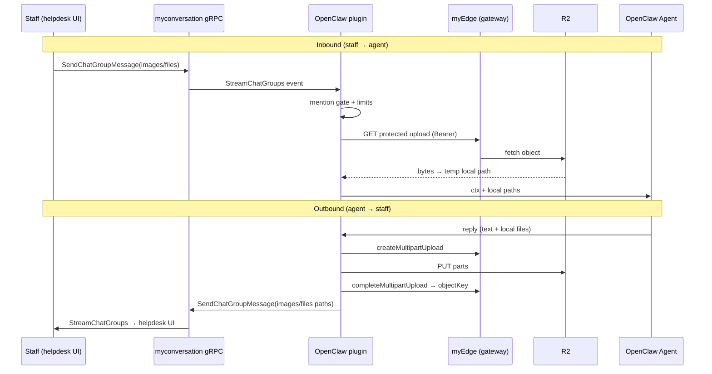

# OpenClaw myconversation — Send File / Media Design Spec

**Date:** 2026-07-09  
**Status:** Approved (brainstorming)  
**Scope:** Staff Group Chat (`ChatGroup`) media for the OpenClaw channel plugin — inbound + outbound.  
**Repo:** `openclaw/myconversation` (`@marketplace/openclaw-myconversation`)  
**Reference pattern:** helpdesk chat-group send (`uploadFile` + `sendChatGroupMessage`)

---

## 1. Summary

Extend the OpenClaw **myconversation** channel plugin so agents can **send and receive** images and document files in staff group chat, matching the helpdesk upload → gRPC path pattern.

Today the plugin is text-only (`capabilities.media: false`). The backend `SendChatGroupMessage` / `ChatGroupMessageInfo` already support `images[]`, `videos[]`, and `files[]` as URL/path strings. This feature wires OpenClaw media hooks, myEdge multipart upload, inbound download-to-temp, and reply chunking for attachments.

**No Go backend changes** are required for v1.

---

## 2. Decisions (locked)

| Topic | Decision |
|-------|----------|
| Direction | **Both** inbound (staff → agent) and outbound (agent → staff) |
| Media types v1 | **`images` + `files` only** — no outbound video |
| Inbound video | **Skip entirely** (debug log); do not download or put in agent context |
| Upload | **myEdge multipart → R2** (parity with helpdesk), not gateway simple PUT |
| Inbound delivery | **Download to local temp** → pass local paths to the agent |
| Limits | Max **5** attachments per message; **20MB** per file |
| Backend | No new RPCs; reuse `SendChatGroupMessage` + stream fields |
| Chat surface | Staff Group Chat only (not inbox / DM) |
| Approach | Modular `src/media/` layer (upload, download, classify, limits) |

---

## 3. Architecture



### Components

| Unit | Responsibility | Depends on |
|------|----------------|------------|
| `src/media/classify.ts` | MIME → `image` \| `document` (→ `images[]` / `files[]`) | none |
| `src/media/limits.ts` | Enforce max 5 attachments, 20MB/file | none |
| `src/media/upload.ts` | myEdge multipart upload; return object keys | `@genjutsu/myedge-connect`, account config |
| `src/media/download.ts` | Resolve URL, auth fetch, write temp files, cleanup | account config, `fs` |
| `src/media/context.ts` | Build agent body append lines + MediaPaths | download results |
| `src/outbound/reply.ts` | Chunked send; attachments on first chunk; file-only send | connect client |
| `src/inbound/dispatch.ts` | Download after mention gate; enrich context; deliver with media | media/*, reply |
| `src/channel.ts` | `capabilities.media: true`; media outbound hook | reply, media |

### Helpdesk parity (upload)

Mirror helpdesk `src/utils/uploadFile.ts`:

1. Object key: `api/v1/upload/{userId}/{timestamp}_{uuid}.{ext}`
2. `createMultipartUpload` → parallel part PUTs (10 MiB parts, concurrency 4) → `completeMultipartUpload`
3. On failure: best-effort `abortMultipartUpload`
4. Send RPC receives **object key paths**, not full URLs

Plugin uses Node `Buffer` / `fs` instead of browser `File` / Capacitor.

---

## 4. Inbound flow

### 4.1 Selection

| Proto field | v1 action |
|-------------|-----------|
| `images[]` | Download → local temp |
| `files[]` | Download → local temp |
| `videos[]` | Skip — debug log only |
| `content` | Unchanged raw wire text |

File-only messages (empty `content`) still dispatch when mention gate passes (`mentioned_user_ids` / group policy).

### 4.2 Download pipeline

1. After mention gate succeeds, collect `images` + `files` (ignore `videos`).
2. Cap to **5** total (images first, then files); warn and drop the rest.
3. For each path/URL:
   - Resolve fetch URL (see §4.3)
   - Stream/download with size cap **20MB**; skip oversize with warn
   - Write under `{mediaTempDir}/{messageId}-{uuid}/{basename}`
4. Enrich agent context (§4.4)
5. In `finally` of `handleMyConversationInbound`: best-effort `rm -rf` that temp dir

### 4.3 URL resolution

1. Relative `api/v1/upload/...` → `{endpoint}/{path}` with `Authorization: Bearer` + `x-tenant-id` (helpdesk `resolveApiRequestUrl` pattern)
2. Absolute external `https://...` (not a protected upload path) → fetch without auth
3. Optional `staticUrl` config: try public GET for protected paths first; fall back to gateway auth fetch

### 4.4 Agent context

| Field | Value |
|-------|-------|
| `BodyForAgent` / `RawBody` | Raw `content` plus append lines for media |
| OpenClaw media paths field | Local paths of successful downloads (inspect SDK at implement time for exact field name, e.g. `MediaPaths`) |
| Envelope `Body` | Existing format; may include a short media summary |

Successful append lines:

```text
[Ảnh: /tmp/openclaw-myconversation/.../photo.png]
[Tệp: /tmp/openclaw-myconversation/.../report.pdf]
```

Failed download:

```text
[Ảnh không tải được: api/v1/upload/123/photo.png]
```

Inbound is **best-effort**: download failures do not abort agent dispatch.

### 4.5 Mention gating

Unchanged:

- `requireMention: false` → media messages pass
- `requireMention: true` → need bot in `mentioned_user_ids`, `@username` in text, or wire mention token
- File-only without mention → skip

---

## 5. Outbound flow

### 5.1 Integration points

| Hook | Location | Role |
|------|----------|------|
| `deliver` callback | `inbound/dispatch.ts` | Agent reply after inbound |
| `attachedResults` media hook | `channel.ts` | Proactive / SDK media send |
| `attachedResults.sendText` | `channel.ts` | Text-only (unchanged) |

Set `capabilities.media: true`. Exact OpenClaw SDK hook name/shape (`sendMedia`, etc.) is verified against peer `openclaw >= 2026.6.5` during implementation.

### 5.2 Shared pipeline

```
Agent payload (text + local paths / URLs / existing object keys)
  → validate ≤ 5 attachments, each ≤ 20MB
  → classify MIME → images[] | files[] (skip video/* with warn)
  → upload new bytes via myEdge (concurrency 3); skip upload for existing api/v1/upload/… paths
  → sendChatGroupReplyChunked({ text, images, files })
```

**Outbound is fail-fast:** if any required upload fails, do not send a partial attachment set; rethrow for OpenClaw error handling.

Typing session wraps **upload + send** so staff see typing during upload.

### 5.3 Agent media input formats

| Input | Handling |
|-------|----------|
| Local file path | Read → upload → send |
| External HTTP(S) URL | Download to temp (20MB cap) → upload → send |
| Existing `api/v1/upload/...` path | Pass through to RPC (no re-upload) |
| `video/*` | Skip with warn |

MIME mapping (helpdesk `getFileType` style):

- `image/*` → `images[]`
- Everything else (pdf, office, zip, audio, text, …) → `files[]`

### 5.4 Chunking rules

| Scenario | Behavior |
|----------|----------|
| Short text + files | One message: text + attachments |
| Long text + media | Attachments on **first chunk only**; later chunks text-only |
| File-only (`text` empty) | One message with empty content + attachments |
| > 5 attachments | Reject outbound; do not send |

**Code change:** `sendChatGroupReplyChunked` must not early-return on empty text when `images` or `files` are non-empty.

Mentions (`mentionedUserIds`) remain first-chunk-only (existing rule).

### 5.5 `deliver` callback

Replace “empty text → return” with: skip only when **both** text and media are empty. Extract media from the OpenClaw deliver payload, upload, then call `sendChatGroupReplyChunked` with `images` / `files`.

---

## 6. Config & dependencies

### New optional config fields

| Field | Default | Purpose |
|-------|---------|---------|
| `staticUrl` | `""` | Public static host for inbound read fallback |
| `mediaTempDir` | `{os.tmpdir()}/openclaw-myconversation` | Inbound download root |

### Runtime requirements

- **`userId` required for media operations** (object key prefix + auth). Missing `userId` → clear error on media upload/download; warn at gateway start.
- Existing: `endpoint`, `tenantId`, `token` (unchanged)

### New dependency

```json
"@genjutsu/myedge-connect": "^1.1.0"
```

Same range as helpdesk. Same gateway base URL and auth interceptor pattern as `@genjutsu/myconversation-connect`.

---

## 7. Error handling

| Situation | Behavior |
|-----------|----------|
| Outbound upload fail | Fail entire send; log; rethrow |
| Inbound single-file download fail | Skip file; append failure line; continue |
| Inbound all downloads fail | Dispatch text-only + failure lines |
| File > 20MB | Skip that file; warn |
| > 5 attachments inbound | Keep first 5; warn |
| Inbound / outbound video | Skip; debug/warn log |
| Multipart abort | Best-effort on upload failure |
| Temp cleanup fail | Warn; do not block reply |

**Principle:** inbound best-effort; outbound fail-fast.

---

## 8. Testing

### Unit (vitest)

- MIME classify → `images` / `files`
- Limit enforcement (5 / 20MB)
- File-only `sendChatGroupReplyChunked`
- Attachments only on first chunk
- URL resolve (relative, absolute, static fallback)
- Inbound context append lines (success + failure)

### Manual E2E (`web/chatgroup-test/` + OpenClaw gateway)

1. Staff: image + text `@bot` → agent sees local path, replies
2. Agent: reply with file → staff sees attachment in UI
3. File-only inbound with mention → agent runs
4. Inbound video → ignored; text still works
5. File > 20MB → skipped without crash

---

## 9. Out of scope (v1)

- Video inbound/outbound
- Edit/delete message media
- Customer inbox (`Conversation`) and Direct Messages
- Optimistic UI (plugin has no UI)
- Chat-group `audios[]` (proto has no such field on group messages)
- Agent sticker outbound
- Backend Go / proto changes

---

## 10. File map (expected)

| Path | Change |
|------|--------|
| `src/media/*.ts` | New: classify, limits, upload, download, context |
| `src/outbound/reply.ts` | File-only send; keep first-chunk media |
| `src/inbound/dispatch.ts` | Download + enrich + deliver media |
| `src/channel.ts` | `media: true` + outbound media hook |
| `src/config.ts` | `staticUrl`, `mediaTempDir`; media requires `userId` |
| `src/connect/*` | myEdge client factory (or under `media/`) |
| `package.json` | Add `@genjutsu/myedge-connect` |
| `README.md` | Document media config and limits |
| `*.test.ts` | Unit coverage above |

---

## 11. Success criteria

1. Staff can send images/documents in a group; bot (when gated) receives local files and can reason over them.
2. Agent can reply with images/documents; helpdesk UI shows them like human-sent attachments.
3. Videos are ignored inbound and rejected outbound without breaking text chat.
4. Limits (5 / 20MB) are enforced consistently.
5. No myconversation Go service changes required for v1.
